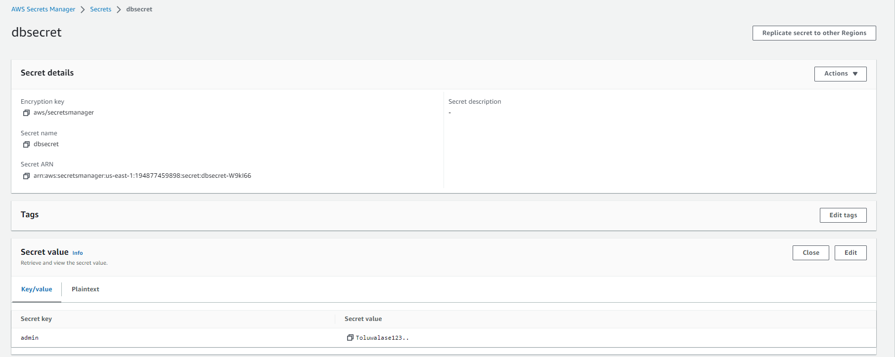
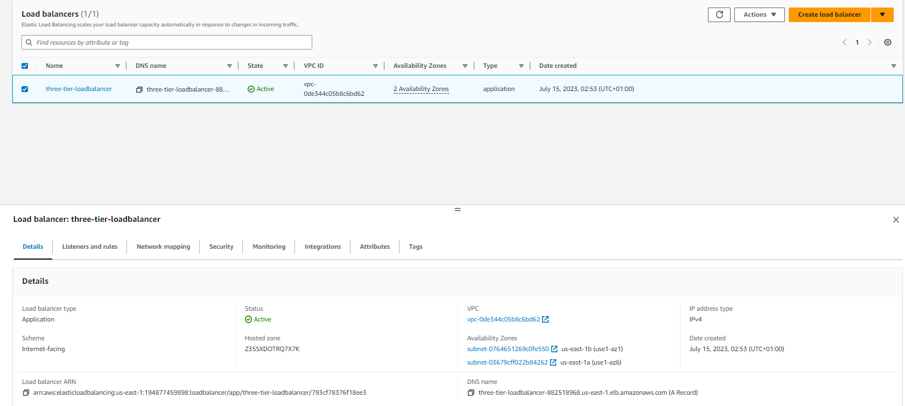
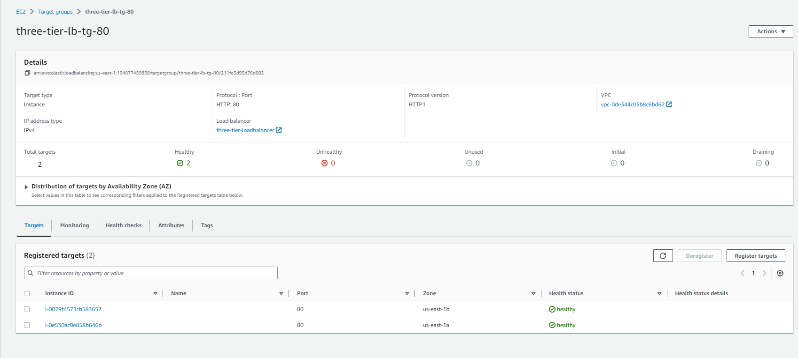
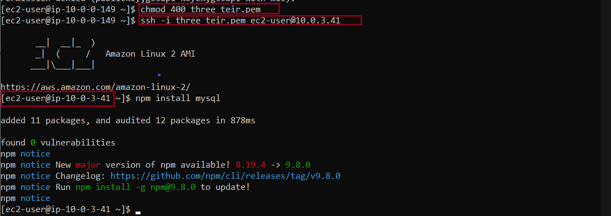

Scalable and Secure Web Application Architecture
## Terraform: AWS Three-Tier Architecture
    In this project, we will create a three-tier architecture leveraging Terraform modules to make the process easily repeatable and reusable. Our architecture will reside in a custom VPC.
    The web tier will have a bastion host and NAT gateway in the public subnets. The bastion host will serve as our access point to the underlying infrastructure. The NAT Gateway will allow our private subnets to access updates from the internet.
    In the application tier, we will create an internet facing load balancer to direct internet traffic to an autoscaling group in the private subnets, along with a backend autoscaling group for our backend application. We will create a script to install the apache webserver in the frontend, and a script to install Node.js in the backend.
    We will have another layer of private subnets in the database tier hosting a MySQL database which will will eventually access using Node.js.

## Pre-requists

1. Craete a Secret and store secret value manually on AWS Console

2. Update terraform.tfvars file with respect to your secret credentials
    ```hcl
    dbuser        = "admin"
    secret_name   = "dbsecret"
    ```
   
## Modules

| Name | Source | Version |
|------|--------|---------|
| <a name="module_compute"></a> [compute](#module\_compute) | ./compute | n/a |
| <a name="module_database"></a> [database](#module\_database) | ./database | n/a |
| <a name="module_loadbalancing"></a> [loadbalancing](#module\_loadbalancing) | ./loadbalancing | n/a |
| <a name="module_networking"></a> [networking](#module\_networking) | ./networking | n/a |


## Inputs

| Name | Description | Type | Default | Required |
|------|-------------|------|---------|:--------:|
| <a name="input_access_ip"></a> [access\_ip](#input\_access\_ip) | n/a | `string` | n/a | yes |
| <a name="input_db_name"></a> [db\_name](#input\_db\_name) | n/a | `string` | n/a | yes |
| <a name="input_dbpassword"></a> [dbpassword](#input\_dbpassword) | n/a | `string` | n/a | yes |
| <a name="input_dbuser"></a> [dbuser](#input\_dbuser) | n/a | `string` | n/a | yes |

## Outputs

| Name | Description |
|------|-------------|
| <a name="output_database_endpoint"></a> [database\_endpoint](#output\_database\_endpoint) | n/a |
| <a name="output_load_balancer_endpoint"></a> [load\_balancer\_endpoint](#output\_load\_balancer\_endpoint) | n/a |

## Testing

If you go into your AWS console, you should be able to see the VPC and subnets, internet gateway, route tables and associations, EC2 instances running in the proper locations, load balancers, and RDS database.

1.  vpc


2. Subnets

3. EC2 instances: Only the Bastion will have a public IP address

4. Load Balancer and Target Group


5. Database


If we copy the load balancer endpoint we got from our Terraform output, and place it in the search bar, we will see the message we specified in our script for the Apache webserver.


This will redirect http -> https. you need to approve the not secure certificate 

If we refresh the page, we should see the IP address from the other instance in our frontend autoscaling group.


Make sure to test out the infrastructure. You will need to use the keypair to SSH into the bastion host. Locate the public IP address of your Bastion Instance in the console:

    ssh -i ./id_rsa.pem ec2-user@<Public_IP_Address>

For example, my file path included looks like this:


-> Important

If you want to SSH into the backend application instances, you will need the SSH agent if you are using Windows PowerShell. You should be able to SSH into the frontend, then backend private subnets as well. Simply use the private IP when going into the private subnets. You will need to bring your keypair with you to each instance. Here is the command you would use to do so when entering the Bastion host:
    
    ssh -A ec2-user@<Public_IP_Address>

In order to get into one of the backend application instances, we will go back to the Bastion, and then go to the backend:

Now we will install the MySQL driver to access our AWS database using Node.js. Use the command npm install mysql. Then we will make a JavaScript file to connect with the database:



Go in to edit the file using vim, or your preferred text editor:

    var mysql = require('mysql');
    var con = mysql.createConnection({
    host: "database_endpoint from Terraform Output",
    user: "dbuser from tfvars file",
    password: "dbpassword from tfvars file"
    });
    con.connect(function(err) {
    if (err) throw err;
    console.log("Connected!");
    });
Make sure to :wq 


we will use the command node yourfile.js


Make sure to run a terraform destroy to avoid incurring extra charges for your resources. 